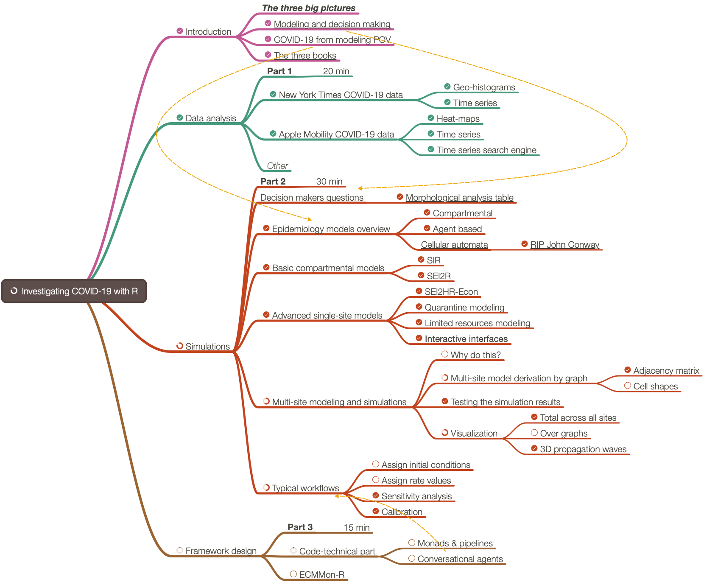

# Investigating COVID-19 with R: data analysis and simulations 
**Methodological presentation**

The 
[extended abstract of the presentation](./ExtendedAbstract.md)
was loosely followed. 
Here is the presentation mind-map:

(Note that mind-map's PDF has hyperlinks. Also, see the folder 
[Presentation-aids](./Presentation-aids)
)

Approximately 25% of the presentation was based on the R-project 
["COVID-19-modeling-in-R"](https://github.com/antononcube/SystemModeling/tree/master/Projects/Coronavirus-propagation-dynamics/R/COVID-19-modeling-in-R),
\[AA1\].

Approximately 30% of the presentation was based on an R-programmed software monad for epidemiology compartmental models,
[ECMMon-R](https://github.com/antononcube/ECMMon-R), 
\[AAr2\].

For the rest were used frameworks, simulations, and graphics made with
[Mathematica](https://www.wolfram.com/mathematica), 
\[AAr1\].

The presentation was given online (because of COVID-19) using Zoom. 
[90 people registered](https://www.meetup.com/rladies-miami/events/270611412/).
Nearly 40 showed up (and maybe 20 stayed throughout.) 

Here is a link to the [video recording]().

[A similar presentation](https://github.com/antononcube/SystemModeling/tree/master/Presentations/UseR!-Meetup-Boston-2020)
was given six weeks prior for [UseR!-Boston-Meetup](https://www.meetup.com/Boston-useR/events/269304135/).

## References

### Coronavirus 

\[Wk1\] Wikipedia entry, 
[Severe acute respiratory syndrome coronavirus 2 (SARS-CoV-2)](https://en.wikipedia.org/wiki/Severe_acute_respiratory_syndrome_coronavirus_2).

\[Wk2\] Wikipedia entry,
[Coronavirus disease 2019](https://en.wikipedia.org/wiki/Coronavirus_disease_2019).

### Modeling

\[Wk3\] Wikipedia entry,
[Compartmental models in epidemiology](https://en.wikipedia.org/wiki/Compartmental_models_in_epidemiology).

\[Wk4\] Wikipedia entry,
[System dynamics](https://en.wikipedia.org/wiki/System_dynamics).

\[JD1\] Jim Duggan, 
[System Dynamics Modeling with R](https://www.springer.com/gp/book/9783319340418), 
2016, Springer.

### R code/software

\[KS1\] Karline Soetaert, Thomas Petzoldt, R. Woodrow Setzer,
["deSolve: Solvers for Initial Value Problems of Differential Equations ('ODE', 'DAE', 'DDE')"](https://cran.r-project.org/web/packages/deSolve/index.html),
[CRAN](https://cran.r-project.org). 

\[JD2\] Jim Duggan, 
["SDMR"](https://github.com/JimDuggan/SDMR), 
2016, 
[GitHub](https://github.com/JimDuggan).   
(Resources for text book "System Dynamics Modeling with R".)
 
\[AA1\] Anton Antonov, 
["COVID-19-modeling-in-R"](https://github.com/antononcube/SystemModeling/tree/master/Projects/Coronavirus-propagation-dynamics/R/COVID-19-modeling-in-R), 
2020,
[SystemModeling at GitHub](https://github.com/antononcube/SystemModeling). 
 
\[AAr1\] Anton Antonov, 
[Coronavirus-propagation-dynamics](../../Projects/Coronavirus-propagation-dynamics), 
2020,
[SystemModeling at GitHub](https://github.com/antononcube/SystemModeling).
 
\[AAr2\] Anton Antonov, 
[Epidemiology Compartmental Modeling Monad in R](https://github.com/antononcube/ECMMon-R), 
2020,
[ECMMon-R at GitHub](https://github.com/antononcube/ECMMon-R). 
