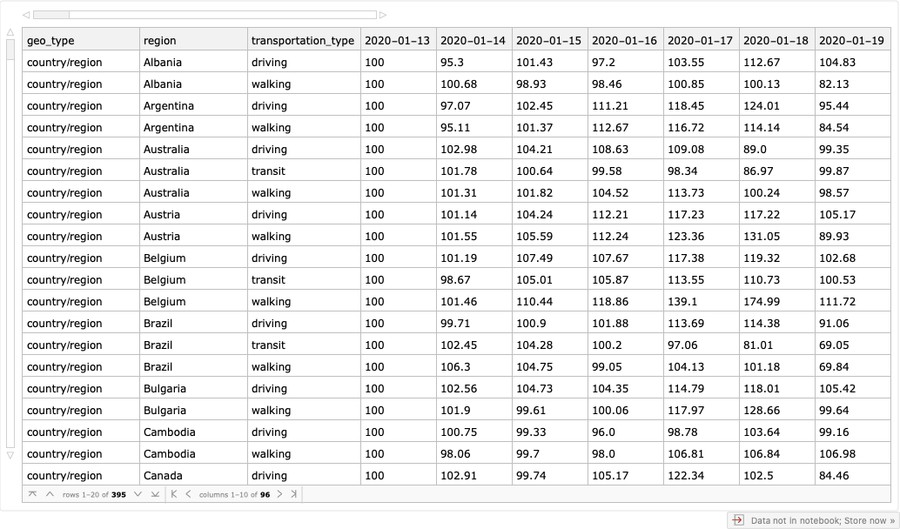
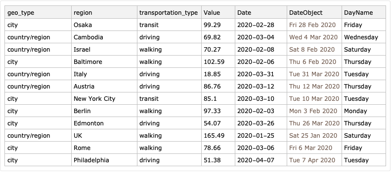
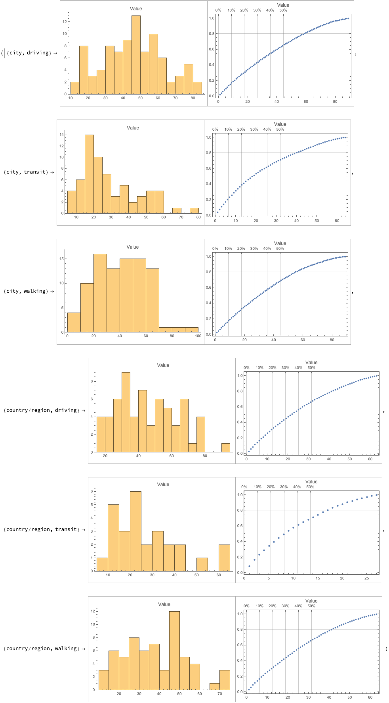
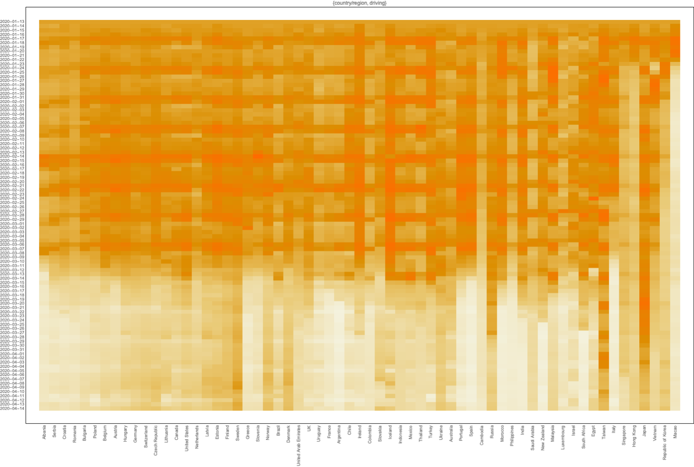
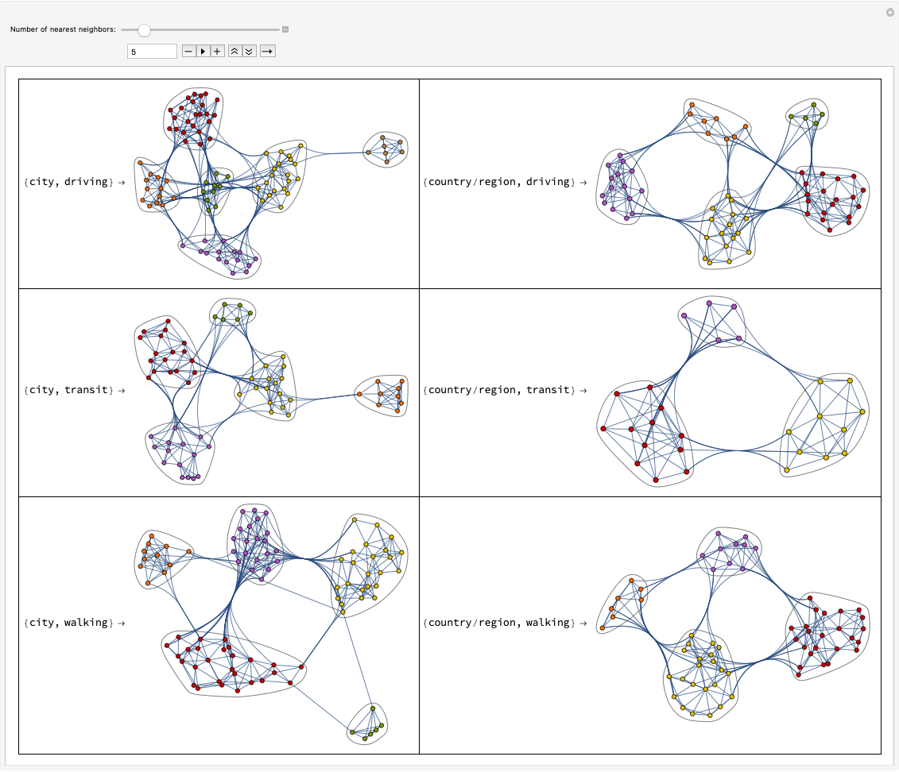
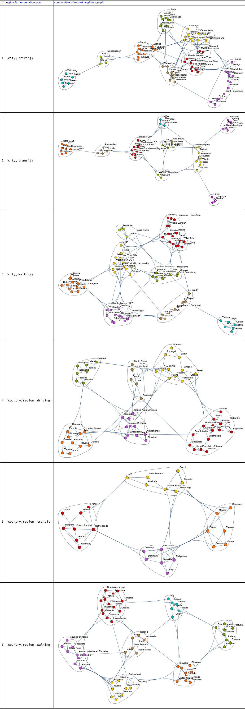
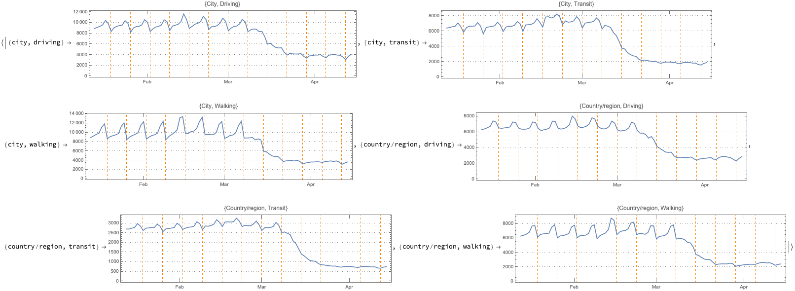
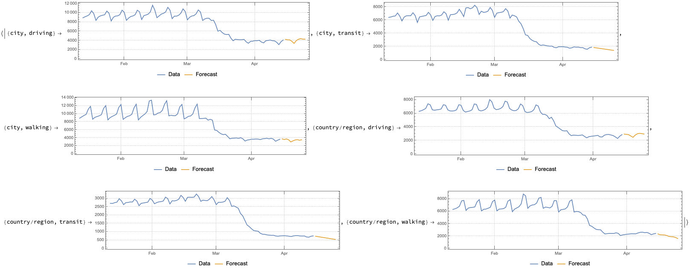

# Apple mobility trends data visualization

**Version 0.9**

Anton Antonov   
[MathematicaForPrediction at WordPress](https://mathematicaforprediction.wordpress.com)  
[SystemModeling at GitHub](https://github.com/antononcube/SystemModeling)  
April 2020  

## Introduction

I this notebook we ingest and visualize the mobility trends data provided by Apple, [APPL1].

We take the following steps:

1. Download the data

1. Import the data and summarise it

1. Transform the data into long form

1. Partition the data into subsets that correspond to combinations of geographical regions and transportation types

1. Make contingency matrices and corresponding heat-map plots

1. Make nearest neighbors graphs over the contingency matrices and plot communities

1. Plot the corresponding time series

### Data description

#### From Apple’s page [https://www.apple.com/covid19/mobility](https://www.apple.com/covid19/mobility)

**About This Data**
The CSV file and charts on this site show a relative volume of directions requests per country/region or city compared to a baseline volume on January 13th, 2020.
We define our day as midnight-to-midnight, Pacific time. Cities represent usage in greater metropolitan areas and are stably defined during this period. In many countries/regions and cities, relative volume has increased since January 13th, consistent with normal, seasonal usage of Apple Maps. Day of week effects are important to normalize as you use this data.
Data that is sent from users’ devices to the Maps service is associated with random, rotating identifiers so Apple doesn’t have a profile of your movements and searches. Apple Maps has no demographic information about our users, so we can’t make any statements about the representativeness of our usage against the overall population.

### Observations

The observations listed in this subsection are also placed under the relevant statistics in the following sections and indicated with “**Observation**”.

- The directions requests volumes reference date for normalization is 2020-01-13 : all the values in that column are $100$.

- From the community clusters of the nearest neighbor graphs (derived from the time series of the normalized driving directions requests volume) we see that countries and cities are clustered in expected ways. For example, in the community graph plot corresponding to “{city, driving}” the cities Oslo, Copenhagen, Helsinki, Stockholm, and Zurich are placed in the same cluster. In the graphs corresponding to “{city, transit}” and “{city, walking}” the Japanese cities Tokyo, Osaka, Nagoya, and Fukuoka are clustered together.

- In the time series plots the Sundays are indicated with orange dashed lines. We can see that from Monday to Thursday people are more familiar with their trips than say on Fridays and Saturdays. We can also see that on Sundays people (on average) are more familiar with their trips or simply travel less.

## Load packages

```mathematica
Import["https://raw.githubusercontent.com/antononcube/MathematicaForPrediction/master/DataReshape.m"]
Import["https://raw.githubusercontent.com/antononcube/MathematicaForPrediction/master/Misc/HeatmapPlot.m"]
```

## Data ingestion

Apple mobile data was provided in this WWW page: [https://www.apple.com/covid19/mobility](https://www.apple.com/covid19/mobility) , [APPL1]. (The data has to be download from that web page -- there is an “agreement to terms”, etc.)

```mathematica
dsAppleMobility = ResourceFunction["ImportCSVToDataset"]["~/Downloads/applemobilitytrends-2020-04-14.csv"]
```



**Observation:** The directions requests volumes reference date for normalization is 2020-01-13 : all the values in that column are $100$.

Data dimensions:

```mathematica
Dimensions[dsAppleMobility]

(*{395, 96}*)
```

Data summary:

```mathematica
Magnify[ResourceFunction["RecordsSummary"][dsAppleMobility], 0.6]
```


Number of unique “country/region” values:

```mathematica
Length[Union[Normal[dsAppleMobility[Select[#["geo_type"] == "country/region" &], "region"]]]]

(*63*)
```

Number of unique “city” values:

```mathematica
Length[Union[Normal[dsAppleMobility[Select[#["geo_type"] == "city" &], "region"]]]]

(*89*)
```

All unique geo types:

```mathematica
lsGeoTypes = Union[Normal[dsAppleMobility[All, "geo_type"]]]

(*{"city", "country/region"}*)
```

All unique transportation types:

```mathematica
lsTransportationTypes = Union[Normal[dsAppleMobility[All, "transportation_type"]]]

(*{"driving", "transit", "walking"}*)
```

## Transform data

It is better to have the data in [long form (narrow form)](https://en.wikipedia.org/wiki/Wide_and_narrow_data). 
For that I am using the package ["DataReshape.m"](https://github.com/antononcube/MathematicaForPrediction/blob/master/DataReshape.m), [AAp1].

```mathematica
lsIDColumnNames = {"geo_type", "region", "transportation_type"};
dsAppleMobilityLongForm = ToLongForm[dsAppleMobility, lsIDColumnNames, Complement[Keys[dsAppleMobility[[1]]], lsIDColumnNames]];
Dimensions[dsAppleMobilityLongForm]

(*{36735, 5}*)
```

Remove the rows with “empty” values:

```mathematica
dsAppleMobilityLongForm = dsAppleMobilityLongForm[Select[#Value != "" &]];
Dimensions[dsAppleMobilityLongForm]

(*{36735, 5}*)
```

Rename the column “Variable” to “Date” and add a related “DateObject” column:

```mathematica
AbsoluteTiming[
 dsAppleMobilityLongForm = 
   dsAppleMobilityLongForm[All, Join[KeyDrop[#, "Variable"], <|"Date" -> #Variable, "DateObject" -> DateObject[#Variable]|>] &];
 ]

(*{16.9671, Null}*)
```

Add “day name” (“day of the week”) field:

```mathematica
dsAppleMobilityLongForm = dsAppleMobilityLongForm[All, Join[#, <|"DayName" -> DateString[#DateObject, {"DayName"}]|>] &];
```

Here is sample of the transformed data:

```mathematica
SeedRandom[3232]
RandomSample[dsAppleMobilityLongForm, 12]
```



Here is summary:

```mathematica
ResourceFunction["RecordsSummary"][dsAppleMobilityLongForm]
```


Partition the data into geo types × transportation types:

```mathematica
aQueries = 
  Association@
   Flatten@Outer[
     Function[{gt, tt}, {gt, tt} -> 
       dsAppleMobilityLongForm[Select[#["geo_type"] == gt && #["transportation_type"] == tt &]]], lsGeoTypes, lsTransportationTypes];
```

## Basic data analysis

We consider relative volume o directions requests for the last date only. (The queries can easily adjusted for other dates.)

```mathematica
lastDate = Last@Sort@Normal@dsAppleMobilityLongForm[All, "Date"]

(*"2020-04-14"*)
```

```mathematica
aDayQueries = 
  Association@
   Flatten@Outer[
     Function[{gt, tt}, {gt, tt} -> dsAppleMobilityLongForm[Select[#["geo_type"] == gt && #Date == lastDate && #["transportation_type"] == tt &]]], 
     lsGeoTypes, lsTransportationTypes];
```

```mathematica
Dimensions /@ aDayQueries

(*<|{"city", "driving"} -> {89, 7}, {"city", "transit"} -> {64, 7}, {"city", "walking"} -> {89, 7}, 
    {"country/region", "driving"} -> {63, 7}, {"country/region", "transit"} -> {27, 7}, 
    {"country/region", "walking"} -> {63, 7}|>*)
```

Here we plot histograms and Pareto principle adherence:

```mathematica
opts = {PlotRange -> All, ImageSize -> Medium};
Grid[
   Function[{columnName},
     {Histogram[#, 12, PlotLabel -> columnName, opts], 
        ResourceFunction["ParetoPrinciplePlot"][#, PlotLabel -> columnName, opts]} &@Normal[#[All, "Value"]]
     ] /@ {"Value"},
   Dividers -> All, FrameStyle -> GrayLevel[0.7]] & /@ aDayQueries
```



## Heat-map plots

We can visualize the data using heat-map plots. Here we use the package ["HeatmapPlot.m"](https://github.com/antononcube/MathematicaForPrediction/blob/master/Misc/HeatmapPlot.m), [AAp2].

**Remark:** Using the contingency matrices prepared for the heat-map plots we can do further analysis, like, finding correlations or nearest neighbors. (See below.)

Cross-tabulate dates with regions:

```mathematica
aMatDateRegion = ResourceFunction["CrossTabulate"][#[All, {"Date", "region", "Value"}], "Sparse" -> True] & /@ aQueries;
```

Make a heat-map plot by sorting the columns of the cross-tabulation matrix (that correspond to countries):

```mathematica
aHeatMapPlots = 
 Association@
  KeyValueMap[#1 -> 
     Rasterize[
      HeatmapPlot[#2, PlotLabel -> #1, 
       DistanceFunction -> {None, CosineDistance}, 
       AspectRatio -> 1/1.6, ImageSize -> 1600]] &, aMatDateRegion]
```


(We use Rasterize in order to reduce the size of the notebook.)

Here we take closer look to one of the plots:

```mathematica
aHeatMapPlots[{"country/region", "driving"}]
```



## Nearest neighbors graphs

### Graphs overview

Here we create nearest neighbor graphs of the contingency matrices computed above and plot cluster the nodes:

```mathematica
Manipulate[
 Multicolumn[
  Normal@Map[
    CommunityGraphPlot @ NearestNeighborGraph[Normal[Transpose[#SparseMatrix]], nns, ImageSize -> Medium] &, aMatDateRegion], 2, Dividers -> All],
 {{nns, 5, "Number of nearest neighbors:"}, 2, 30, 1, Appearance -> "Open"}, SaveDefinitions -> True]
```



### Closer look into the graphs

Here we endow each nearest neighbors graph with appropriate vertex labels:

```mathematica
aNNGraphs = 
  Map[NearestNeighborGraph[Normal[Transpose[#SparseMatrix]], 3, VertexLabels -> Thread[Rule[Normal[Transpose[#SparseMatrix]], #ColumnNames]]] &,
    aMatDateRegion];
```

Here we plot the graphs with clusters:

```mathematica
ResourceFunction["GridTableForm"][
 List @@@ Normal[CommunityGraphPlot[#, ImageSize -> 800] & /@ aNNGraphs], 
 TableHeadings -> {"region & transportation type", "communities of nearest neighbors graph"}, Background -> White, 
 Dividers -> All]
```



**Observation:** From the community clusters of the nearest neighbor graphs (derived from the time series of the normalized driving directions requests volume) we see that countries and cities are clustered in expected ways. 
For example in the community graph plot corresponding to “{city, driving}” the cities Oslo, Copenhagen, Helsinki, Stockholm, and Zurich are placed in the same cluster. 
In the graphs corresponding to “{city, transit}” and “{city, walking}” the Japanese cities Tokyo, Osaka, Nagoya, and Fukuoka are clustered together.

## Time series analysis

### Time series

In this section for each date we sum all cases over the region-transportation pairs, make a time series, and plot them. 

**Remark:** In the plots the Sundays are indicated with orange dashed lines.

Here we make the time series:

```mathematica
aTSDirReqByCountry =
 Map[
  Function[{dfQuery},
   TimeSeries@(List @@@ 
      Normal[GroupBy[Normal[dfQuery], #DateObject &, 
        Total[#Value & /@ #] &]])
   ],
  aQueries
  ]
```


Here we plot them:

```mathematica
opts = {PlotTheme -> "Detailed", PlotRange -> All, AspectRatio -> 1/4,
    ImageSize -> Large};
Association@KeyValueMap[
  Function[{transpType, ts},
   transpType ->
    DateListPlot[ts, 
     GridLines -> {AbsoluteTime /@ 
        Union[Normal[ dsAppleMobilityLongForm[Select[#DayName == "Sunday" &], "DateObject"]]], Automatic}, 
     GridLinesStyle -> {Directive[Orange, Dashed], 
       Directive[Gray, Dotted]}, PlotLabel -> Capitalize[transpType], 
     opts]
   ],
  aTSDirReqByCountry
  ]
```



**Observation:** In the time series plots the Sundays are indicated with orange dashed lines. 
We can see that from Monday to Thursday people are more familiar with their trips than say on Fridays and Saturdays. 
We can also see that on Sundays people (on average) are more familiar with their trips or simply travel less.

### “Forecast”

He we do “forecast” for code-workflow demonstration purposes -- the forecasts should not be taken seriously.

Fit a time series model to the time series:

```mathematica
aTSModels = TimeSeriesModelFit /@ aTSDirReqByCountry
```


Plot data and forecast:

```mathematica
Map[DateListPlot[{#["TemporalData"], TimeSeriesForecast[#, {10}]}, 
   opts, PlotLegends -> {"Data", "Forecast"}] &, aTSModels]
```



## References

[APPL1] Apple Inc., [Mobility Trends Reports](https://www.apple.com/covid19/mobility), (2020), [apple.com](https://www.apple.com).

[AA1] Anton Antonov, ["NY Times COVID-19 data visualization"](https://github.com/antononcube/SystemModeling/blob/master/Projects/Coronavirus-propagation-dynamics/Documents/NYTimes-COVID-19-data-visualization.md), (2020), [SystemModeling at GitHub](https://github.com/antononcube/SystemModeling).

[AAp1] Anton Antonov, [Data reshaping Mathematica package](https://github.com/antononcube/MathematicaForPrediction/blob/master/DataReshape.m), (2018), [MathematicaForPrediciton at GitHub](https://github.com/antononcube/MathematicaForPrediction).

[AAp2] Anton Antonov, [Heatmap plot Mathematica package](https://github.com/antononcube/MathematicaForPrediction/blob/master/Misc/HeatmapPlot.m), (2018), [MathematicaForPrediciton at GitHub](https://github.com/antononcube/MathematicaForPrediction).
